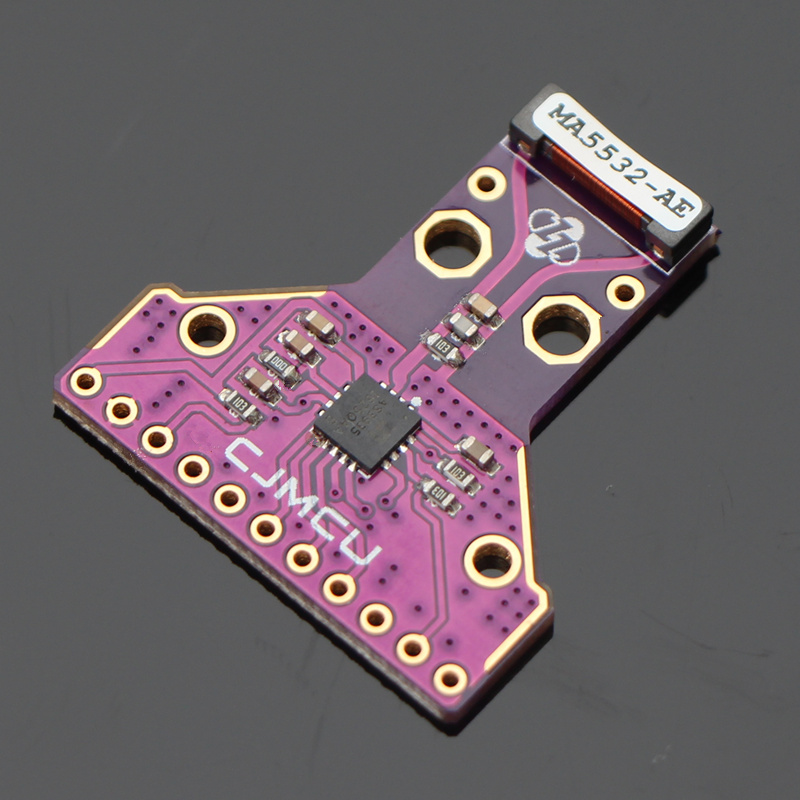
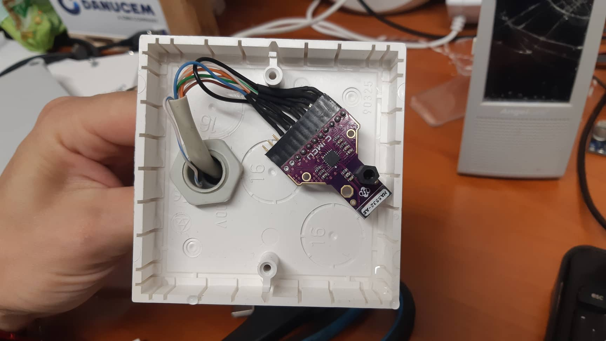
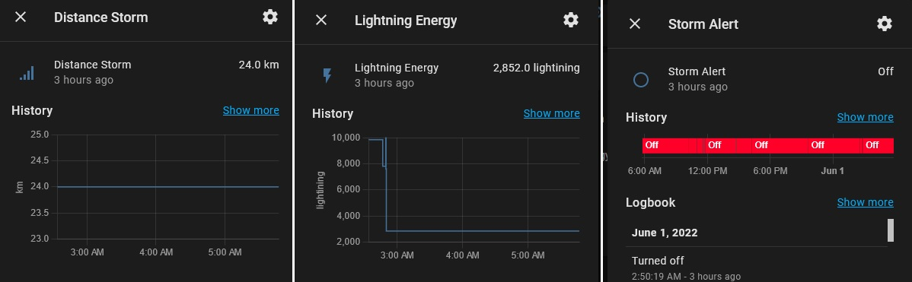

# AS3935 lightning sensor - Lightning detection storm distance
Home Assistant and ESPHOME


**CHANGELOG:**
2025-06-11
- replace esp32-s to esp32-c3
- replace new sensor as3935
- fixed setup capacitance code
- add RC filter
- add time interval lightning
- autocalibrate and showing frequency
- add event on new code
- 
**FEATURES:**
- Connection to the home assistant using esphome
- Lightning detection, their distance and strength
- Run on solar drive
- Sleep mode
- Activation upon detection of storm or weather alarm
- Battery status
- Showing oscillator frequency on anetnna

**PARTS REQUIRED:**
 - 1x ESP32-S + 
 - Adapter for ESP32
 - 2x button smd
 - 2x SMD 10kΩ resistor
 - 1x [CJMCU AMS AS3935](https://www.aliexpress.com/item/32829119257.html)
 - 1x LDO ht7833 regulator
 - 2x Ceramic capacitor 10uF
 - 1x Aluminium Capacitor 470-630uF
 - 2x Battery 2000-3000mAh 18650
 - 1x TP4065 charger module whit bms
 - 1x Solar panel 5V 5W
 - 1x Diode shottky 1N5817
 
**PARTS OPTIONAL:**
 - 1x NPN3904
 - 1x PNP3906
 - 2x 220Ω resistor
 - 1x 680kΩ resistor
 - 1x 330kΩ resistor
 - 1x Prototype PCB board 4x6cm
 - 1x 8Pin PCB Mount Female Socket Connector RJ45
 - 1x 8 Pin Male RJ45 connector
 - 1m lan cable
 - 2x Prototype box
 - 1x 2.54 male 40pins header
 - 1x 2.54 female 8pins header
 - 1x JST 2.54 connector male - female whit cable
 - 1x DC Power Adapter Connector 5.5*2.1 male - female
 - 1x LED red status

 **PARTS OPTIONAL CALIBRATING ANTENNA:**
 - ceramics capacitor
 
**CIRCUIT:**
LIGHTINING SENSOR:
- Position of the sensor must be in a horizontal position (I had a lot of interference with the vertical one).
- At least 1m from ESP.
- As far as possible from all EMI interferers.

- SPI WIRING disable voltage regulator.. I couldn't get the correct values in I2C
Top view 
```
------------------------------------------------------------------------------------------
PINS: VCC | GND |   SCL   |   MOSI   |   MISO   |   CS   |  SI |   IRQ   | EN_V | A0 | A1
NAME: 3v3 | GND | SPI_CLK | SPI_MOSI | SPI_MISO | AMS_CS | GND | AMS_IRQ |  NC  | NC | NC 
------------------------------------------------------------------------------------------
```

STATUS LEDS
GPIO02 -> +LED -> -LED -> 220Ω -> GND
    
Charging Battery Solar panel
- TP4056 or similar module
- battery 18650 2x min. 1800mAh (according to the number of sunny days) + JST connector
- protect battery BMS 1s
- Solar panel + DC009 socket and protect diode shottky 1N5817 low drop 0.3V
  
**HOME ASSISTANT CONFIGURATION**
- add custom integration [meteoalarm](https://www.home-assistant.io/integrations/meteoalarm/)
- add custom integration [openweathermap](https://www.home-assistant.io/integrations/openweathermap/)
  
- add custom sensor for lightning counting in configuration.yaml
```
utility_meter:
  light_counter_daily:
    source: sensor.weather_lightining_lightning_counter
    cycle: daily
  light_counter_monthly:
    source: sensor.weather_lightining_lightning_counter
    cycle: monthly
```

**CODE**

everything needed in the file "weather-lightining.yaml"

**MAKE**


**RESOLUTS**


**CALIBRATIG ANTENNA**
[Reference](https://www.improwis.com/projects/sw_chip_AS3935/)

Ready frequnecy: tune_antenna: true and connect irq pin to oscilloscope and ready frequency (whit multiply div_ration)
(implementet on this code ready whit pulse_counter frequency whitout oscilloscope)
The frequency has to be within +-3.5% from the recommended 500 kHz: 
raw: 500     kHz (482.50 ~ 517.500 kHz)
16:   31.25  kHz ( 30.16 ~  32.340 kHz)
128:   3.906 kHz (  3.77 ~   4.043 kHz)

Modifications:
Change bad value capacitor on module: isntalled cap is 1000pF and 68 pF
[Source](https://tasmota.github.io/docs/AS3935/#breakout-boards-issues)
After tested good value is: 1x1nF and 100pf = 1100pF (Measure whit multimeter is value capacitor is smaller)
Measure frequency is: 7.8kHz whit 64 ratio = 499kHz


Tester:

